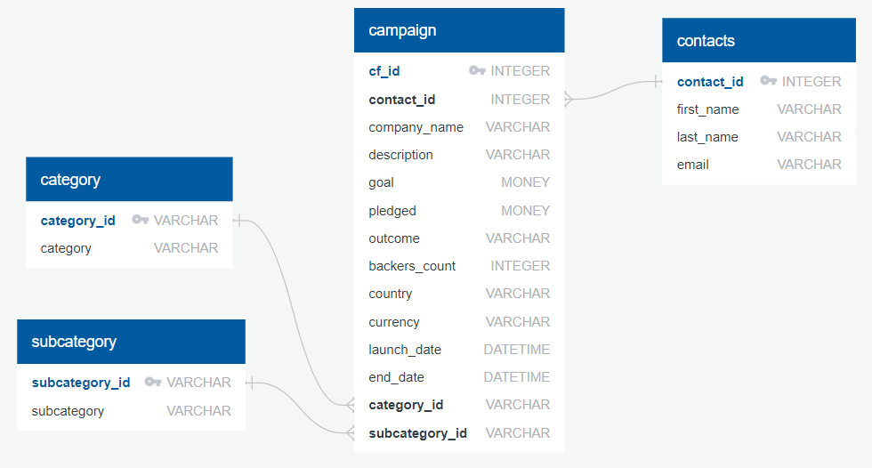

Group 1 Team
Members: Leah Nash, Sandra Braun, Jared Hubert, Veronica Ostapowich

Overview

In this project we built an ETL pipeline using Python, Pandas, and either Python dictionary methods or regular expressions to extract and transform the data. Once the data was transformed, we created four CSV files and use the CSV file data to create an ERD and a table schema. The final CSV file data was uploaded into a Postgres database. These are the tasks completed for this project:

    *Create the Category and Subcategory DataFrames
    *Create the Campaign DataFrame
    *Create the Contacts DataFrame
    *Create the Crowdfunding Database

Data Sources: We worked with the data provided on the Starter Files: contacts.xlsx and crowfunding.xlsx

Findings: Our final production database is relational.

  

